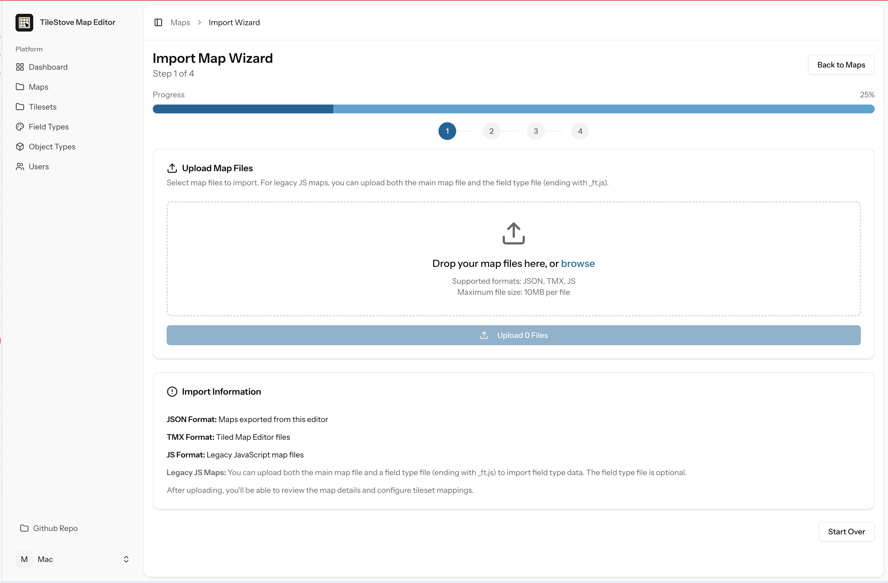
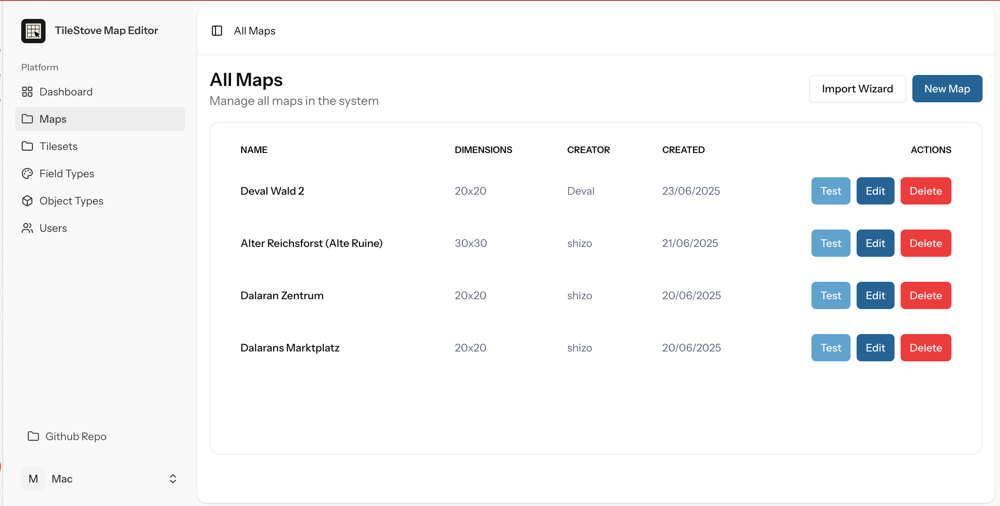
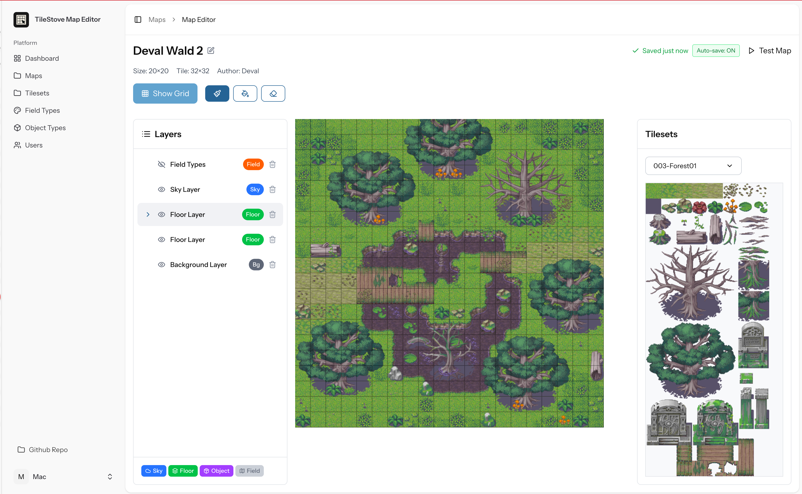
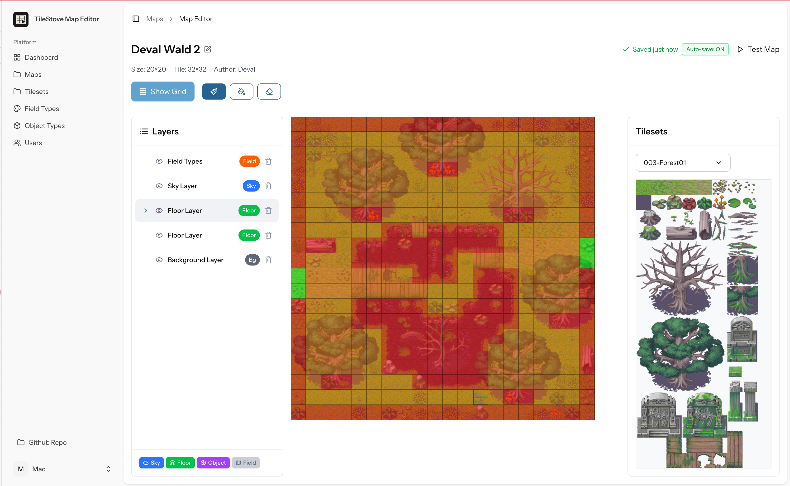
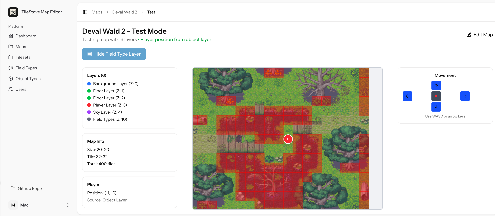

# TileStove Map Editor

A web-based tile map editor, with the goal of being easy to use and self-hostable.

Keep in mind that this editor is still a work in progress.

## Features

- **Web-based and Self-hostable**: Host it on your own server or locally using Docker.
- **Layered Editing**: Use multiple layers to build complex maps, including layers for background, objects, floors, and sky.
- **TileSet Management**: Import and manage your tilesets.
- **Map Import/Export**: Import maps from `JSON`, `TMX` and legacy `JS` formats via an import wizard.
- **Field Types**: Define special tile behaviors, like collision, custom interactions, etc.
- **Object Layers**: Add objects to your map for things like player start positions, NPCs, or events.
- **Map Testing**: Test your maps directly in the editor, including collision detection.
- **User Management**: Manage users who can access the editor.

## Screenshots

**Import Wizard: Easily import your maps**


**Map List: Manage all your maps**


**Map Editor: General map editor**


**Field Types: Use field types to easily control movement and interactions**


**Map Test: Test your maps with collision detection**


## Installation

```bash
$ npm install
```

## Running the app with Docker

```bash
docker-compose up -d
```

## Running the app without Docker

- Have Composer, PHP 8.2 and MySQL installed localled

```bash
composer dev
```

# Limitations

Import and Export for TMX files is currently limited to the CSV format.

# To Do

Open to suggestions :)

- Keyboard shortcuts for the tools

# Credits

Based on an old tile based browsergame for [Last Anixile](http://www.last-anixile.de)
The working original was written in PHP and rests in
the [legacy branch](https://github.com/Macavity/mapeditor/tree/legacy). Bear in mind that the code was created in 2005
;-) - 'twas a different time then.. I made just rough corrections so it works outside it's previous frame.

- Tilesets magecity and castle_exterior_mc were made by Hyptosis on [NewGrounds](https://hyptosis.newgrounds.com/) and on [OGA](http://opengameart.org/content/mage-city-arcanos)
