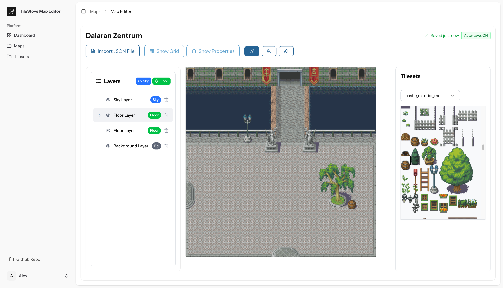

# TileMap Editor

The editor gives you the ability to have your very own tile map editor which can be easily hosted locally or on any basic web server.

Keep in mind that this editor is still a work in progress.



## Installation

```bash
$ npm install
```

## Running the app with Docker

```bash
docker-compose up -d
```

## Running the app without Docker

- Have Composer, PHP 8.2 and MySQL installed localled

```bash
composer dev
```

# Limitations

Import and Export for TMX files is currently limited to the CSV format.

# To Do

Open to suggestions :)

- Keyboard shortcuts for the tools
- Testdrive a map - walk around with a character, test collisions

# Credits

Based on an old tile based browsergame for [Last Anixile](http://www.last-anixile.de)
The working original was written in PHP and rests in
the [legacy branch](https://github.com/Macavity/mapeditor/tree/legacy). Bear in mind that the code was created in 2005
;-) - 'twas a different time then.. I made just rough corrections so it works outside it's previous frame.

- Tilesets magecity and castle_exterior_mc were made by Hyptosis on [NewGrounds](https://hyptosis.newgrounds.com/) and on [OGA](http://opengameart.org/content/mage-city-arcanos)
